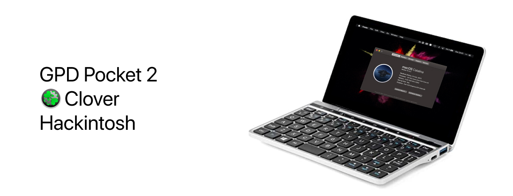

Build your own MacBook Mini with your GPD Pocket 2.

Want to support the development and stay updated?

 

What's not working:
- wifi
- internal sound
- emmc

But besides that it works great - even the touchscreen works, thanks to the help of some other github users.